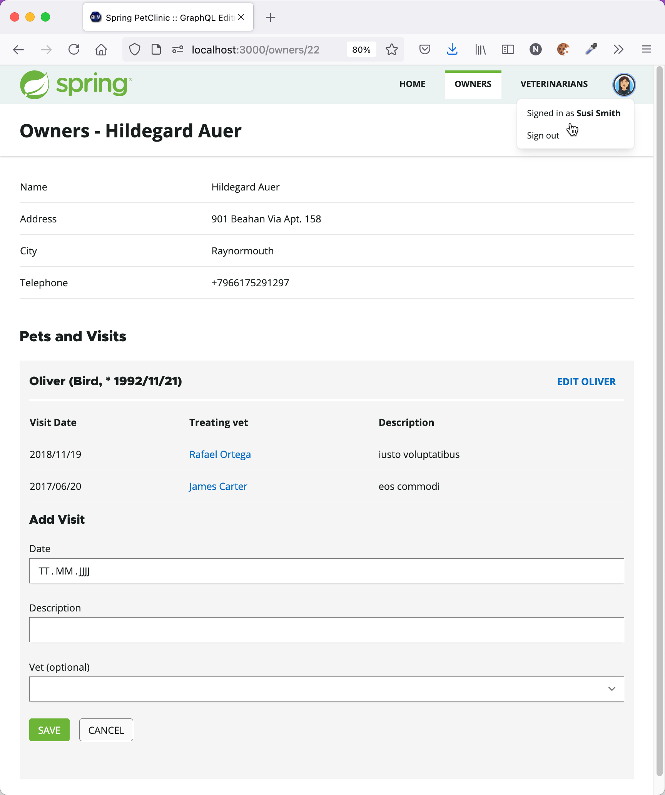

# Spring PetClinic Sample Application using spring-graphql

This PetClinic version uses the new [spring-graphql](https://github.com/spring-projects/spring-graphql) project, that has been [introduced](https://spring.io/blog/2021/07/06/hello-spring-graphql) in july 2021
and is going to be shipped with Spring Boot 2.7.

This version currenty uses **Spring Boot 2.7 M3** with **GraphQL for Spring 1.0.0-M6**.

It implements a [GraphQL API](http://graphql.org/) for the PetClinic and
provides an example Frontend for the API.

[](https://github.com/spring-petclinic/spring-petclinic-graphql/actions/workflows/maven-build.yml)

[](https://gitpod.io/#https://github.com/spring-petclinic/spring-petclinic-graphql)

## Features

As spring-graphql is still experimental, this PetClinic is experimental and in-progress too.

Some features that are built in:

* [Annotated Controllers](https://docs.spring.io/spring-graphql/docs/current-SNAPSHOT/reference/html/#controllers) (see `SpecialtyController` and `VetController`)
* Subscriptions via Websockets (see `VisitController`)  
* Own scalar types (See `PetClinicRuntimeWiringConfiguration`)
* GraphQL Interfaces (GraphQL Type `Person`) and Unions (GraphQL Type `AddVetPayload`), see class `PetClinicRuntimeWiringConfiguration`
* Security: the `/graphql` http and WebSocket endpoints are secured and can only be accessed using a JWT token. More fine grained security is implemented using `@PreAuthorize` (see `VetService`) 
* Pagination and Sorting of results: implemented with `spring-data`, see `OwnerQueryWiring`
* Tests: See `test` folder for typical GraphQL endpoint tests, including tests for security

## Running the Server

The server is implemented in the `backend` folder and can be started either from your IDE (`org.springframework.samples.petclinic.PetClinicApplication`) or
using maven from the root folder of the repository:

```
./mvnw spring-boot:run -pl backend
```

Note: the server runs on port **9977**, so make sure, this port is available.

(The server uses an in-memory database, so no external DB is needed)

## Accessing the GraphQL API

You can access the GraphQL API via the included customized version of GraphiQL.

The included GraphiQL adds support for login to the original GraphiQL.

You can use the following users for login:

* **joe/joe**: Regular user
* **susi/susi**: has Manager Role and is allowed to execute the `createVet` Mutation

After starting the server, GraphiQL runs on [http://localhost:9977](http://localhost:9977)

**Note**: The WebSocket/Subscription support in GraphiQL is far from being robust. Use with care!


## Running the frontend

While you can access the whole GraphQL API from GraphiQL this demo application also
contains a modified version of the classic PetClinic UI. Compared to the original
client this client is built as a Single-Page-Application using **React** and **Apollo GraphQL**
and has slightly different features to make it a more realistic use-case for GraphQL.

You can install and start the frontend by using npm:

```
cd ./frontend

npm install

npm start
```

The running frontend can be accessed on [http://localhost:3000](http://localhost:3000).

For valid users to login, see list above.




# Contributing

If you like to help and contribute you're more than welcome! Please open [an issue](https://github.com/spring-petclinic/spring-petclinic-graphql/issues) or a [Pull Request](https://github.com/spring-petclinic/spring-petclinic-graphql/pulls)
 
